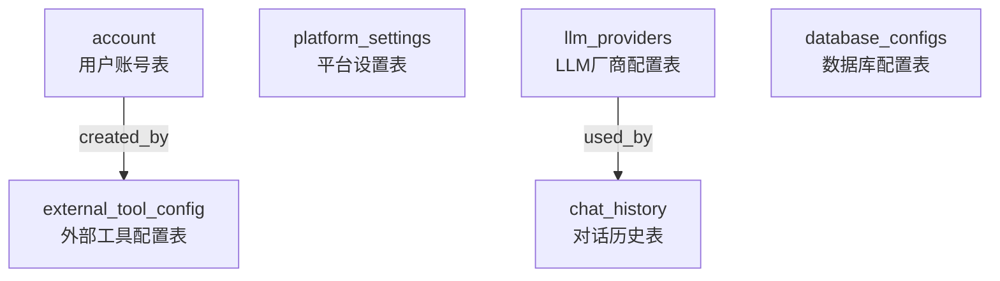

# 灵龙AI智能平台 - 数据库设计文档

**版本**: 1.0.0  
**更新时间**: 2026-05-14  
**数据库类型**: MySQL 8.0 / PostgreSQL 14+ (pgvector)

---

## 目录

1. [数据库架构概述](#一数据库架构概述)
2. [MySQL 数据库](#二mysql-数据库)
   - [用户账号表 (account)](#1-用户账号表-account)
   - [平台设置表 (platform_settings)](#2-平台设置表-platform_settings)
   - [LLM厂商配置表 (llm_providers)](#3-llm厂商配置表-llm_providers)
   - [数据库配置表 (database_configs)](#4-数据库配置表-database_configs)
   - [外部工具配置表 (external_tool_config)](#5-外部工具配置表-external_tool_config)
   - [对话历史表 (chat_history)](#6-对话历史表-chat_history)
3. [PostgreSQL 数据库](#三postgresql-数据库)
   - [向量存储表 (vector_store)](#1-向量存储表-vector_store)
4. [数据字典](#四数据字典)
5. [索引策略](#五索引策略)
6. [ER图](#六er图)

---

## 一、数据库架构概述

### 1.1 数据库分布

本项目采用多数据库架构，不同业务模块使用不同的数据库系统：

| 数据库类型 | 用途 | 服务模块 |
|-----------|------|---------|
| MySQL 8.0 | 用户认证、平台设置、配置管理 | linglong-user, linglong-agent, linglong-mcp-server |
| PostgreSQL + pgvector | 向量存储、知识库检索 | linglong-llm-core |
| Redis | 会话缓存、Agent上下文共享 | 所有服务 |

### 1.2 字符集与排序规则

- **MySQL**: `utf8mb4` / `utf8mb4_unicode_ci`
- **PostgreSQL**: `UTF8` / `en_US.UTF-8`

---

## 二、MySQL 数据库

### 1. 用户账号表 (account)

**描述**: 存储平台用户的基本信息和认证凭据

**SQL定义**:
```sql
CREATE TABLE IF NOT EXISTS `account` (
    `id` INT AUTO_INCREMENT PRIMARY KEY COMMENT '用户ID',
    `username` VARCHAR(50) NOT NULL UNIQUE COMMENT '用户名',
    `password` VARCHAR(100) NOT NULL COMMENT '密码（BCrypt加密）',
    `role` TINYINT DEFAULT 0 COMMENT '角色：0-普通用户，1-管理员',
    `mobile` VARCHAR(20) COMMENT '手机号',
    `create_time` DATETIME DEFAULT CURRENT_TIMESTAMP COMMENT '创建时间',
    `update_time` DATETIME DEFAULT CURRENT_TIMESTAMP ON UPDATE CURRENT_TIMESTAMP COMMENT '更新时间'
) ENGINE=InnoDB DEFAULT CHARSET=utf8mb4 COMMENT='用户账号表';
```

**字段说明**:

| 字段名 | 类型 | 必填 | 默认值 | 说明 |
|--------|------|------|--------|------|
| id | INT | 是 | 自增 | 用户唯一标识 |
| username | VARCHAR(50) | 是 | - | 用户名，全局唯一 |
| password | VARCHAR(100) | 是 | - | BCrypt加密后的密码 |
| role | TINYINT | 否 | 0 | 用户角色：0-普通用户，1-管理员 |
| mobile | VARCHAR(20) | 否 | NULL | 手机号码 |
| create_time | DATETIME | 否 | CURRENT_TIMESTAMP | 记录创建时间 |
| update_time | DATETIME | 否 | CURRENT_TIMESTAMP | 记录更新时间 |

**索引**:
- 主键: `id`
- 唯一索引: `username`

**示例数据**:
```sql
INSERT INTO `account` (`username`, `password`, `role`, `mobile`) VALUES 
('admin', '$2a$10$N.zmdr9k7uOCQb376NoUnuTJ8iAt6Z5EHsM8lE9lBOsl7iAt6Z5EO', 1, '13800138001'),
('user', '$2a$10$N.zmdr9k7uOCQb376NoUnuTJ8iAt6Z5EHsM8lE9lBOsl7iAt6Z5EO', 0, '13800138002');
```

---

### 2. 平台设置表 (platform_settings)

**描述**: 存储平台的全局配置项，支持动态修改

**SQL定义**:
```sql
CREATE TABLE IF NOT EXISTS platform_settings (
    id BIGINT AUTO_INCREMENT PRIMARY KEY,
    setting_key VARCHAR(100) NOT NULL UNIQUE,
    setting_value TEXT,
    setting_type VARCHAR(50),
    description VARCHAR(255),
    created_at TIMESTAMP DEFAULT CURRENT_TIMESTAMP,
    updated_at TIMESTAMP DEFAULT CURRENT_TIMESTAMP ON UPDATE CURRENT_TIMESTAMP,
    INDEX idx_setting_key (setting_key)
);
```

**字段说明**:

| 字段名 | 类型 | 必填 | 默认值 | 说明 |
|--------|------|------|--------|------|
| id | BIGINT | 是 | 自增 | 配置项ID |
| setting_key | VARCHAR(100) | 是 | - | 配置键名，全局唯一 |
| setting_value | TEXT | 否 | NULL | 配置值 |
| setting_type | VARCHAR(50) | 否 | NULL | 数据类型：string/boolean/integer/json |
| description | VARCHAR(255) | 否 | NULL | 配置描述 |
| created_at | TIMESTAMP | 否 | CURRENT_TIMESTAMP | 创建时间 |
| updated_at | TIMESTAMP | 否 | CURRENT_TIMESTAMP | 更新时间 |

**索引**:
- 主键: `id`
- 唯一索引: `setting_key`
- 普通索引: `idx_setting_key`

**默认配置项**:
```sql
INSERT INTO platform_settings (setting_key, setting_value, setting_type, description) VALUES
('platform.name', '玲珑AI平台', 'string', '平台名称'),
('platform.notification', 'true', 'boolean', '系统通知开关'),
('platform.autoSave', 'true', 'boolean', '自动保存开关'),
('security.jwt.enabled', 'false', 'boolean', 'JWT认证开关'),
('security.jwt.expireHours', '24', 'integer', 'Token过期时间(小时)'),
('security.operationLog.enabled', 'false', 'boolean', '操作日志开关')
ON DUPLICATE KEY UPDATE setting_value = VALUES(setting_value);
```

---

### 3. LLM厂商配置表 (llm_providers)

**描述**: 存储大语言模型供应商的配置信息，支持多模型路由

**SQL定义**:
```sql
CREATE TABLE IF NOT EXISTS llm_providers (
    id VARCHAR(36) PRIMARY KEY,
    provider VARCHAR(50) NOT NULL,
    provider_name VARCHAR(100),
    model VARCHAR(100) NOT NULL,
    api_key VARCHAR(500) NOT NULL,
    base_url VARCHAR(500),
    temperature DOUBLE DEFAULT 0.7,
    max_tokens INT DEFAULT 4096,
    is_default BOOLEAN DEFAULT FALSE,
    is_active BOOLEAN DEFAULT TRUE,
    created_at TIMESTAMP DEFAULT CURRENT_TIMESTAMP,
    updated_at TIMESTAMP DEFAULT CURRENT_TIMESTAMP ON UPDATE CURRENT_TIMESTAMP,
    INDEX idx_provider (provider),
    INDEX idx_is_default (is_default),
    INDEX idx_is_active (is_active)
);
```

**字段说明**:

| 字段名 | 类型 | 必填 | 默认值 | 说明 |
|--------|------|------|--------|------|
| id | VARCHAR(36) | 是 | UUID | 配置ID |
| provider | VARCHAR(50) | 是 | - | 厂商标识：zhipu/openai/deepseek/aliyun/custom |
| provider_name | VARCHAR(100) | 否 | NULL | 厂商显示名称 |
| model | VARCHAR(100) | 是 | - | 默认模型名称 |
| api_key | VARCHAR(500) | 是 | - | API密钥（建议加密存储） |
| base_url | VARCHAR(500) | 否 | NULL | API基础URL |
| temperature | DOUBLE | 否 | 0.7 | 温度参数（0-1） |
| max_tokens | INT | 否 | 4096 | 最大输出token数 |
| is_default | BOOLEAN | 否 | FALSE | 是否为默认供应商 |
| is_active | BOOLEAN | 否 | TRUE | 是否启用 |
| created_at | TIMESTAMP | 否 | CURRENT_TIMESTAMP | 创建时间 |
| updated_at | TIMESTAMP | 否 | CURRENT_TIMESTAMP | 更新时间 |

**索引**:
- 主键: `id`
- 普通索引: `idx_provider`, `idx_is_default`, `idx_is_active`

---

### 4. 数据库配置表 (database_configs)

**描述**: 存储外部数据库连接配置，用于MCP工具访问

**SQL定义**:
```sql
CREATE TABLE IF NOT EXISTS database_configs (
    id VARCHAR(36) PRIMARY KEY,
    db_type VARCHAR(50) NOT NULL,
    host VARCHAR(255) NOT NULL,
    port INT NOT NULL,
    database_name VARCHAR(100) NOT NULL,
    username VARCHAR(100) NOT NULL,
    password VARCHAR(500) NOT NULL,
    status VARCHAR(50),
    connection_params TEXT,
    created_at TIMESTAMP DEFAULT CURRENT_TIMESTAMP,
    updated_at TIMESTAMP DEFAULT CURRENT_TIMESTAMP ON UPDATE CURRENT_TIMESTAMP,
    INDEX idx_db_type (db_type)
);
```

**字段说明**:

| 字段名 | 类型 | 必填 | 默认值 | 说明 |
|--------|------|------|--------|------|
| id | VARCHAR(36) | 是 | UUID | 配置ID |
| db_type | VARCHAR(50) | 是 | - | 数据库类型：mysql/postgresql/oracle/mssql |
| host | VARCHAR(255) | 是 | - | 数据库主机地址 |
| port | INT | 是 | - | 端口号 |
| database_name | VARCHAR(100) | 是 | - | 数据库名称 |
| username | VARCHAR(100) | 是 | - | 用户名 |
| password | VARCHAR(500) | 是 | - | 密码（建议加密存储） |
| status | VARCHAR(50) | 否 | NULL | 连接状态：active/inactive/testing |
| connection_params | TEXT | 否 | NULL | 额外连接参数（JSON格式） |
| created_at | TIMESTAMP | 否 | CURRENT_TIMESTAMP | 创建时间 |
| updated_at | TIMESTAMP | 否 | CURRENT_TIMESTAMP | 更新时间 |

**索引**:
- 主键: `id`
- 普通索引: `idx_db_type`

---

### 5. 外部工具配置表 (external_tool_config)

**描述**: 存储用户自定义的外部MCP工具配置，将HTTP API封装为工具

**SQL定义**:
```sql
CREATE TABLE IF NOT EXISTS external_tool_config (
    id BIGINT AUTO_INCREMENT PRIMARY KEY,
    tool_name VARCHAR(100) NOT NULL UNIQUE,
    display_name VARCHAR(200) NOT NULL,
    description VARCHAR(1000),
    category VARCHAR(50) NOT NULL,
    source VARCHAR(20) NOT NULL DEFAULT 'external',
    api_url VARCHAR(2000),
    http_method VARCHAR(10) DEFAULT 'GET',
    headers TEXT,
    parameters TEXT,
    response_extractor VARCHAR(1000),
    enabled BOOLEAN NOT NULL DEFAULT TRUE,
    created_by BIGINT,
    icon VARCHAR(100),
    created_at TIMESTAMP DEFAULT CURRENT_TIMESTAMP,
    updated_at TIMESTAMP DEFAULT CURRENT_TIMESTAMP ON UPDATE CURRENT_TIMESTAMP,
    INDEX idx_category (category),
    INDEX idx_enabled (enabled)
);
```

**字段说明**:

| 字段名 | 类型 | 必填 | 默认值 | 说明 |
|--------|------|------|--------|------|
| id | BIGINT | 是 | 自增 | 工具配置ID |
| tool_name | VARCHAR(100) | 是 | - | 工具名称，全局唯一 |
| display_name | VARCHAR(200) | 是 | - | 工具显示名称 |
| description | VARCHAR(1000) | 否 | NULL | 工具描述 |
| category | VARCHAR(50) | 是 | - | 工具分类：filesystem/database/http/ai |
| source | VARCHAR(20) | 是 | external | 来源：external/local |
| api_url | VARCHAR(2000) | 否 | NULL | 外部API URL |
| http_method | VARCHAR(10) | 否 | GET | HTTP方法：GET/POST/PUT/DELETE |
| headers | TEXT | 否 | NULL | 请求头配置（JSON格式） |
| parameters | TEXT | 否 | NULL | 参数定义（JSON格式） |
| response_extractor | VARCHAR(1000) | 否 | NULL | 响应提取表达式（JSONPath） |
| enabled | BOOLEAN | 是 | TRUE | 是否启用 |
| created_by | BIGINT | 否 | NULL | 创建者用户ID |
| icon | VARCHAR(100) | 否 | NULL | 图标标识 |
| created_at | TIMESTAMP | 否 | CURRENT_TIMESTAMP | 创建时间 |
| updated_at | TIMESTAMP | 否 | CURRENT_TIMESTAMP | 更新时间 |

**索引**:
- 主键: `id`
- 唯一索引: `tool_name`
- 普通索引: `idx_category`, `idx_enabled`

---

### 6. 对话历史表 (chat_history)

**描述**: 存储多轮对话的历史记录（可选，需配置MySQL数据源）

**SQL定义**:
```sql
CREATE TABLE IF NOT EXISTS chat_history (
    id BIGINT AUTO_INCREMENT PRIMARY KEY,
    chat_id VARCHAR(100) NOT NULL,
    role VARCHAR(20) NOT NULL,
    content TEXT NOT NULL,
    model VARCHAR(100),
    tokens_used INT,
    metadata JSON,
    created_at TIMESTAMP DEFAULT CURRENT_TIMESTAMP,
    INDEX idx_chat_id (chat_id),
    INDEX idx_created_at (created_at)
);
```

**字段说明**:

| 字段名 | 类型 | 必填 | 默认值 | 说明 |
|--------|------|------|--------|------|
| id | BIGINT | 是 | 自增 | 消息ID |
| chat_id | VARCHAR(100) | 是 | - | 会话ID |
| role | VARCHAR(20) | 是 | - | 角色：user/assistant/system |
| content | TEXT | 是 | - | 消息内容 |
| model | VARCHAR(100) | 否 | NULL | 使用的模型名称 |
| tokens_used | INT | 否 | NULL | 消耗的token数 |
| metadata | JSON | 否 | NULL | 元数据（JSON格式） |
| created_at | TIMESTAMP | 否 | CURRENT_TIMESTAMP | 创建时间 |

**索引**:
- 主键: `id`
- 普通索引: `idx_chat_id`, `idx_created_at`

---

## 三、PostgreSQL 数据库

### 1. 向量存储表 (vector_store)

**描述**: 存储向量化后的文档、代码片段和知识库内容，支持语义检索

**前置条件**: 需要安装 pgvector 扩展

```sql
CREATE EXTENSION IF NOT EXISTS vector;
```

**SQL定义**:
```sql
CREATE TABLE IF NOT EXISTS vector_store (
    id        UUID      PRIMARY KEY DEFAULT gen_random_uuid(),
    content   TEXT,
    metadata  JSONB,
    embedding VECTOR(1024)
);
```

**字段说明**:

| 字段名 | 类型 | 必填 | 默认值 | 说明 |
|--------|------|------|--------|------|
| id | UUID | 是 | gen_random_uuid() | 文档唯一标识 |
| content | TEXT | 否 | NULL | 文档内容（文本/代码） |
| metadata | JSONB | 否 | NULL | 元数据（JSON格式） |
| embedding | VECTOR(1024) | 否 | NULL | 1024维向量（智谱AI embedding-3） |

**索引**:
- 主键: `id`
- HNSW索引: `vector_store_embedding_hnsw_idx` (余弦相似度)

```sql
CREATE INDEX IF NOT EXISTS vector_store_embedding_hnsw_idx
ON vector_store
USING hnsw (embedding vector_cosine_ops)
WITH (m = 16, ef_construction = 64);
```

**自定义函数**:

#### cosine_similarity_search - 向量相似度搜索

```sql
CREATE OR REPLACE FUNCTION cosine_similarity_search(
    query_vector VECTOR,
    limit_count INTEGER DEFAULT 10
)
RETURNS TABLE (
    id UUID,
    content TEXT,
    metadata JSONB,
    similarity FLOAT
)
AS $$
BEGIN
    RETURN QUERY
    SELECT 
        vs.id,
        vs.content,
        vs.metadata,
        1 - (vs.embedding <=> query_vector) AS similarity
    FROM vector_store vs
    ORDER BY vs.embedding <=> query_vector
    LIMIT limit_count;
END;
$$ LANGUAGE plpgsql;
```

#### hybrid_search - 混合搜索（向量+关键词）

```sql
CREATE OR REPLACE FUNCTION hybrid_search(
    query_text TEXT,
    query_vector VECTOR,
    keyword_weight FLOAT DEFAULT 0.3,
    vector_weight FLOAT DEFAULT 0.7,
    limit_count INTEGER DEFAULT 10
)
RETURNS TABLE (
    id UUID,
    content TEXT,
    metadata JSONB,
    combined_score FLOAT
)
AS $$
BEGIN
    RETURN QUERY
    WITH vector_results AS (
        SELECT 
            vs.id,
            vs.content,
            vs.metadata,
            1 - (vs.embedding <=> query_vector) AS vector_score
        FROM vector_store vs
        ORDER BY vs.embedding <=> query_vector
        LIMIT limit_count * 2
    )
    SELECT 
        vr.id,
        vr.content,
        vr.metadata,
        (keyword_weight * 0) + (vector_weight * vr.vector_score) AS combined_score
    FROM vector_results vr
    ORDER BY combined_score DESC
    LIMIT limit_count;
END;
$$ LANGUAGE plpgsql;
```

**metadata 字段结构示例**:

```json
{
  "type": "knowledge",
  "projectId": "proj-001",
  "category": "document",
  "filename": "用户手册.pdf",
  "title": "用户手册",
  "uploadTime": "2026-05-14T10:00:00Z",
  "userId": "user-001"
}
```

**常见 type 值**:
- `knowledge`: 知识库文档
- `code`: 代码片段
- `requirement`: 需求文档
- `conversation`: 对话缓存

---

## 四、数据字典

### 4.1 枚举值定义

#### 用户角色 (account.role)
| 值 | 说明 |
|----|------|
| 0 | 普通用户 |
| 1 | 管理员 |

#### 项目状态 (Project.status)
| 值 | 说明 |
|----|------|
| init | 初始化 |
| analyzing | 需求分析中 |
| designing | 架构设计中 |
| coding | 代码生成中 |
| testing | 测试生成中 |
| completed | 已完成 |
| failed | 失败 |

#### LLM供应商类型 (llm_providers.provider)
| 值 | 说明 |
|----|------|
| zhipu | 智谱AI |
| openai | OpenAI |
| deepseek | DeepSeek |
| aliyun | 阿里云通义千问 |
| custom | 自定义 |

#### 工具分类 (external_tool_config.category)
| 值 | 说明 |
|----|------|
| filesystem | 文件系统操作 |
| database | 数据库操作 |
| http | HTTP API调用 |
| ai | AI相关工具 |
| diagram | 图表生成 |
| custom | 自定义 |

#### 对话角色 (chat_history.role)
| 值 | 说明 |
|----|------|
| user | 用户消息 |
| assistant | AI助手回复 |
| system | 系统消息 |

---

## 五、索引策略

### 5.1 MySQL 索引

| 表名 | 索引名 | 字段 | 类型 | 用途 |
|------|--------|------|------|------|
| account | PRIMARY | id | 主键 | 快速查询用户 |
| account | UNIQUE | username | 唯一索引 | 防止用户名重复 |
| platform_settings | PRIMARY | id | 主键 | 快速查询配置 |
| platform_settings | UNIQUE | setting_key | 唯一索引 | 配置键唯一性 |
| platform_settings | idx_setting_key | setting_key | 普通索引 | 按配置键查询 |
| llm_providers | PRIMARY | id | 主键 | 快速查询配置 |
| llm_providers | idx_provider | provider | 普通索引 | 按厂商筛选 |
| llm_providers | idx_is_default | is_default | 普通索引 | 查询默认供应商 |
| llm_providers | idx_is_active | is_active | 普通索引 | 查询启用的供应商 |
| database_configs | PRIMARY | id | 主键 | 快速查询配置 |
| database_configs | idx_db_type | db_type | 普通索引 | 按数据库类型筛选 |
| external_tool_config | PRIMARY | id | 主键 | 快速查询工具 |
| external_tool_config | UNIQUE | tool_name | 唯一索引 | 工具名称唯一性 |
| external_tool_config | idx_category | category | 普通索引 | 按分类筛选 |
| external_tool_config | idx_enabled | enabled | 普通索引 | 查询启用的工具 |
| chat_history | PRIMARY | id | 主键 | 快速查询消息 |
| chat_history | idx_chat_id | chat_id | 普通索引 | 按会话查询历史 |
| chat_history | idx_created_at | created_at | 普通索引 | 按时间排序 |

### 5.2 PostgreSQL 索引

| 表名 | 索引名 | 字段 | 类型 | 用途 |
|------|--------|------|------|------|
| vector_store | PRIMARY | id | 主键 | 快速查询文档 |
| vector_store | vector_store_embedding_hnsw_idx | embedding | HNSW | 向量相似度搜索 |

---

## 六、ER图

### 6.1 MySQL ER图



### 6.2 PostgreSQL ER图


---

## 七、数据安全与隐私

### 7.1 敏感数据加密

以下字段建议在应用层进行加密存储：

| 表名 | 字段 | 加密方式 | 说明 |
|------|------|---------|------|
| account | password | BCrypt | 密码哈希 |
| llm_providers | api_key | AES-256 | API密钥 |
| database_configs | password | AES-256 | 数据库密码 |

### 7.2 数据备份策略

- **MySQL**: 每日全量备份 + binlog增量备份
- **PostgreSQL**: 每日pg_dump备份 + WAL归档
- **Redis**: RDB持久化 + AOF追加

---

## 八、性能优化建议

### 8.1 查询优化

1. **避免SELECT ***: 只查询需要的字段
2. **分页查询**: 使用LIMIT/OFFSET或游标分页
3. **批量操作**: 使用批量插入/更新减少数据库交互
4. **连接池**: 配置合理的连接池大小（HikariCP）

### 8.2 索引优化

1. **覆盖索引**: 为常用查询创建覆盖索引
2. **复合索引**: 多字段查询使用复合索引
3. **定期维护**: 定期分析和重建索引

### 8.3 向量搜索优化

1. **HNSW参数调整**: 根据数据量调整 `m` 和 `ef_construction`
2. **分批建索引**: 大规模数据先导入后建索引
3. **向量维度**: 保持统一的向量维度（1024）

---

## 九、版本历史

| 版本 | 日期 | 变更说明 |
|------|------|---------|
| 1.0.0 | 2026-05-14 | 初始版本，包含所有核心表结构 |

---

**文档维护**: 开发团队  
**联系方式**: dev@linglong.ai
